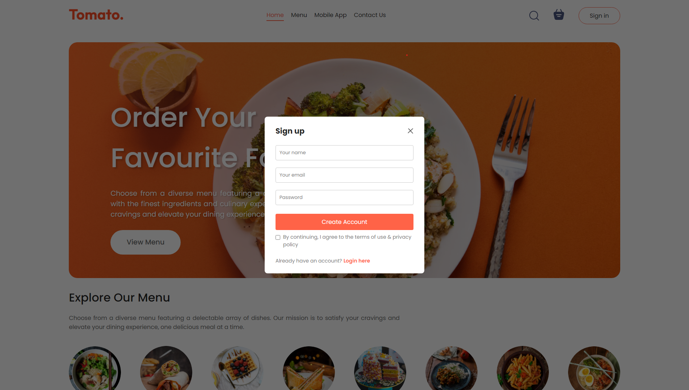
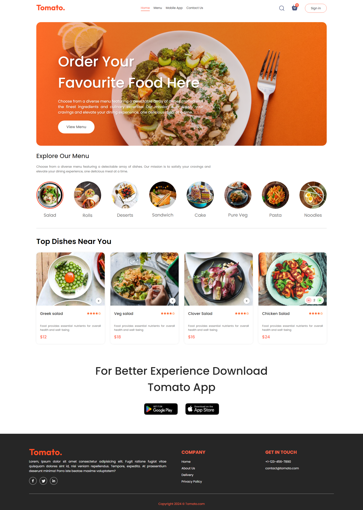
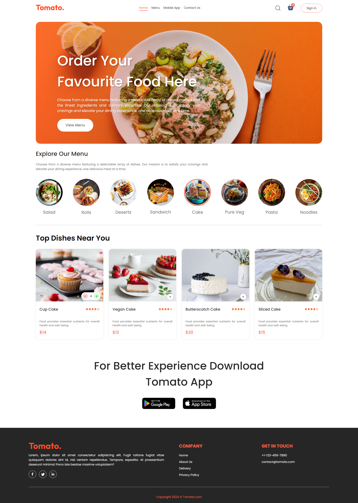
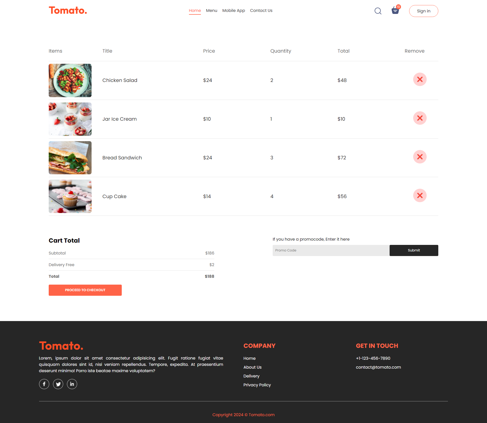
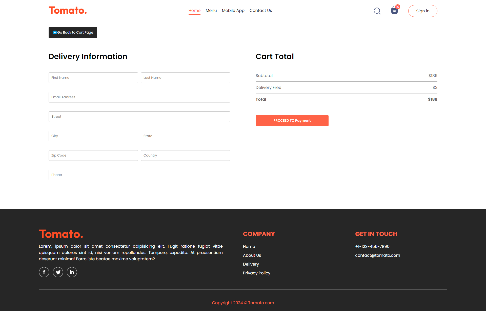

# Food Delivery App Front-End React JS Project

- Modern and clean UI design
- Smooth Scrolling
- Smooth animations and effects
- Change Menu Category
- Add to cart & remove from cart functionality
- View and manage cart items
- Proceed to payment
- Website fully responsive








## 🛠️ Tech Stack

* React.js
* JavaScript (ES6+)
* CSS3
* React Hooks
* Context API / useState
* React Router DOM
* Responsive Design

---

## ⚛️ React Concepts Used

* Functional Components
* Component Reusability
* Props & State Management
* useState Hook
* useEffect Hook
* Conditional Rendering
* Dynamic Rendering
* Event Handling
* Responsive UI Design

---

## 🚀 Getting Started

```bash
git clone REPOSITORY_LINK
cd project-folder
npm install
npm run dev
```
